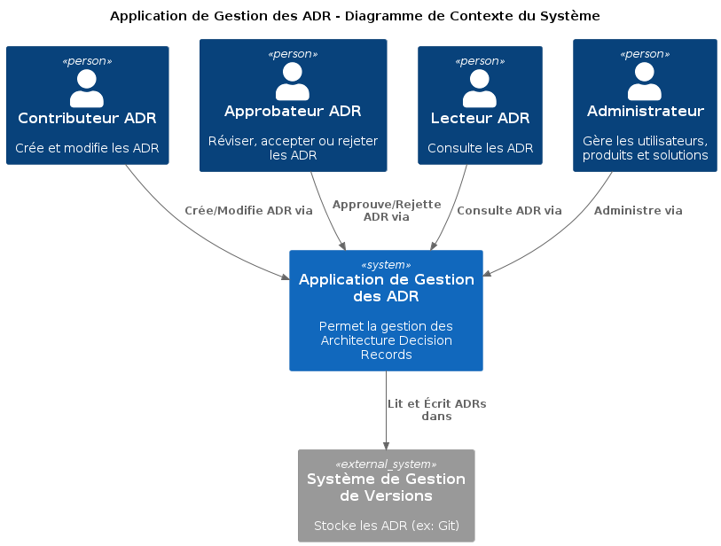
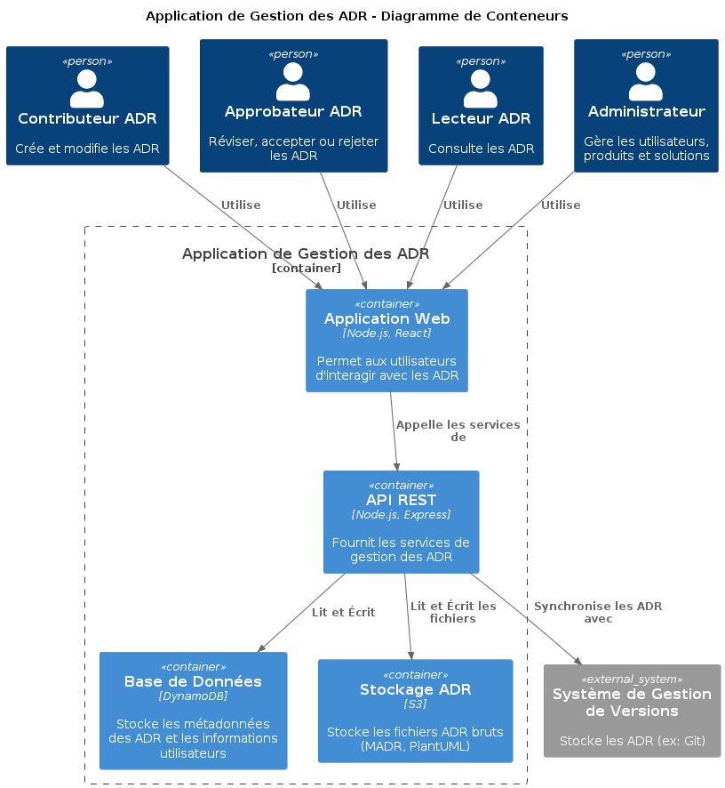
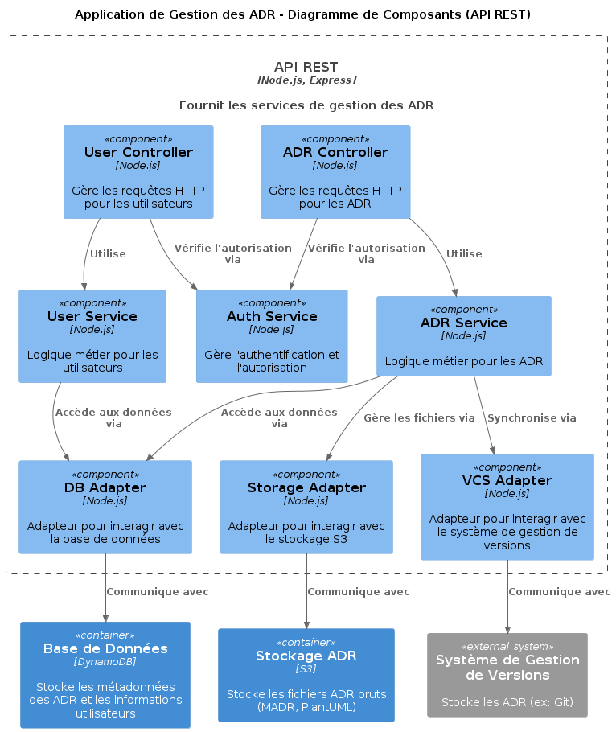

# Documentation de l'Architecture de l'Application de Gestion des ADR

Cette documentation décrit l'architecture de l'application de gestion des Architecture Decision Records (ADR) en utilisant le C4 Model.

## 1. Diagramme de Contexte du Système

Le diagramme de contexte du système montre l'application de gestion des ADR comme une boîte noire, interagissant avec les utilisateurs et un système de gestion de versions externe.

## 2. Diagramme de Conteneurs

Le diagramme de conteneurs décompose l'application en conteneurs de haut niveau, chacun hébergeant du code ou des données.

## 3. Diagramme de Composants (API REST)

Le diagramme de composants détaille les composants internes de l'API REST, montrant leurs responsabilités et leurs interactions.

